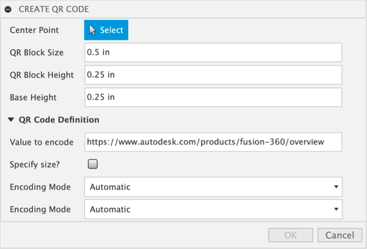
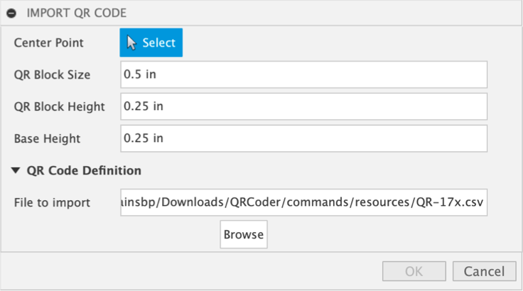
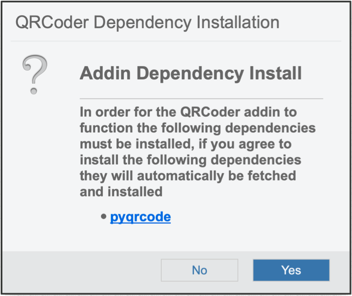

QRCoder
=======
3D QR code geometry generator for Fusion 360

.. image:: docs/resources/readMeCover.png

|

`Pretty Documentation available on Github pages <https://tapnair.github.io/QRCoder/>`_

Usage
-----
Select a sketch point and insert a 3D QR code.

You can either generate a QR code from an input string with various options or you can import a csv file.

Create QR Code
^^^^^^^^^^^^^^
This command will generate a QR code from the input message.  It is based on the **PyQRCode** Package.

See the `full PyQRCode documentation <https://pythonhosted.org/PyQRCode/>`_
for a detailed description of the available encoding options.

In general you select a sketch point for the center then define the block size and the height.
The different options determine exactly how the QR code will be constructed.

Import QR Code
^^^^^^^^^^^^^^
This command allows you to import a QR code generated via another program.

The data should be formatted as a csv file.
Each row of the file corresponds to a row of block data in the resulting QR code.  The format should be 1's and 0's.
A value of 1 indicates that the block should be created for this position.

Installation
------------
- `Download or clone the latest version <https://github.com/tapnair/QRCoder/archive/refs/heads/master.zip>`_
- Unzip the archive to a permanent location on your computer
- It is important that the directory be named *QRCoder*.

*Note: If you are downloading the zip file from github it typically appends -master to the folder name.
You must rename the folder for Fusion 360 to recognize the addin.*

.. image:: docs/resources/install.png

After you download and extract the zip file:

1.	Open the scripts and add-ins dialog box
2.	Select the add-ins tab in the top of the dialog
3.	Click the little green plus button to add the add-in
4.	Select the directory named Export2D and click the open button
5.	With it selected click the run button at the bottom of the dialog

Requirements
^^^^^^^^^^^^
Credit where credit is due!!!

This sample add-in is built upon the `pyqrcode library <https://github.com/mnooner256/pyqrcode>`_

The first time you run the application, depending how you downloaded it,
you may be prompted to install a couple of dependencies:

The required dependency **PyQRCode** from the standard python package index: PyPI

A Git submodule downloaded from github:

.. image:: docs/resources/apper-dependency.png

License
-------
THE SOFTWARE IS PROVIDED "AS IS", WITHOUT WARRANTY OF ANY KIND, EXPRESS OR IMPLIED,
INCLUDING BUT NOT LIMITED TO THE WARRANTIES OF MERCHANTABILITY, FITNESS FOR A PARTICULAR PURPOSE AND NONINFRINGEMENT.
IN NO EVENT SHALL THE AUTHORS OR COPYRIGHT HOLDERS BE LIABLE FOR ANY CLAIM, DAMAGES OR OTHER LIABILITY,
WHETHER IN AN ACTION OF CONTRACT, TORT OR OTHERWISE, ARISING FROM, OUT OF OR IN CONNECTION WITH THE SOFTWARE
OR THE USE OR OTHER DEALINGS IN THE SOFTWARE.

`MIT License`_

.. _MIT License: ./LICENSE

Authors
-------
`QRCoder` was written by `Patrick Rainsberry <patrick.rainsberry@autodesk.com>`_.

See more useful `Fusion 360 Utilities`_

.. _Fusion 360 Utilities: https://tapnair.github.io/index.html

